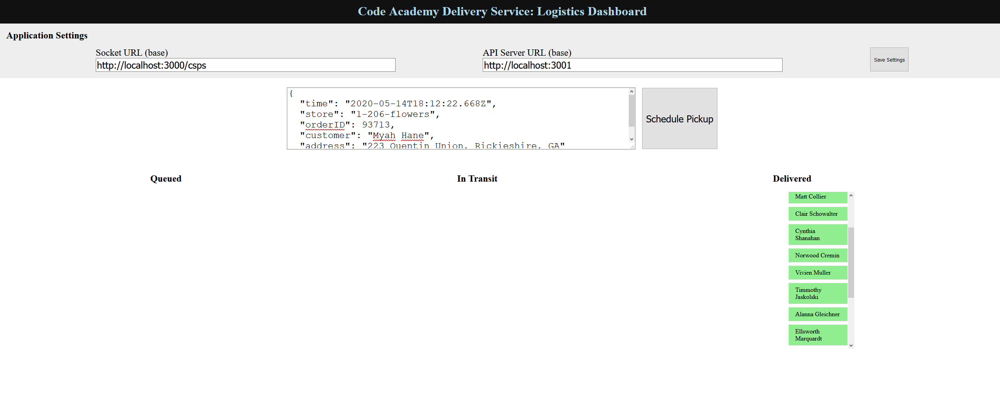
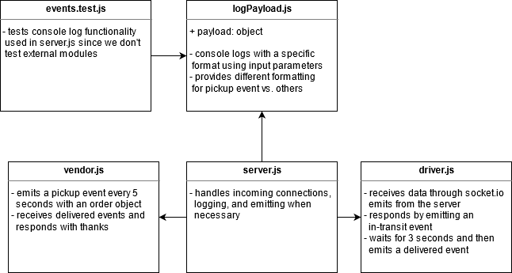

# Lab 19 — Message Queues

## Emulating Order Deliveries with Socket.io and Console Logs

Lab 16, 17, 18, and 19 for CF JS 401 Nights (n16)

### Author: Earl Jay Caoile

### Links and Resources

#### Submission Reqs

- [submission PR](https://github.com/earljay-caoile-401-advanced-javascript/caps-system/pull/4)
- [GitHub Actions](https://github.com/earljay-caoile-401-advanced-javascript/caps-system/actions)

#### Resources and Documentation

- [Faker GitHub Repo](https://github.com/Marak/Faker.js#readme)
- [Socket.io Tutorial](https://www.tutorialspoint.com/socket.io/)
- [Socket.io Emit Cheatsheet](https://socket.io/docs/emit-cheatsheet/)

### Setup

#### Main Lab Requirements

- from the root directory, type `npm i` to install node packages
- type `cd lib` to enter the lib folder
- open 3 terminal windows
- start the three apps in the following order by typing each of the following in a terminal:
  - `node server.js` or `nodemon server.js`
  - `node vendor.js` or `nodemon vendor.js`
  - `node driver.js` or `nodemon driver.js`
- joyfully watch all 3 terminals populate with console logs
- press `ctrl + c` to stop the app
- **NOTE**: the `testStore` variable on line 7 of `vendor.js` is left to a static value. This is because the React app for visual testing (see below) is only configured to work when the store name has a specific value. To ignore this and view random store names, erase the value for `testStore` or remove the mention of it on line 15.

#### Stretch Goal

The Express server with a `POST` API endpoint has also been implemented! To get this working, do the following:

- from the root folder, go the express-server folder with `cd express-server`
- start the server with `node index.js` or `nodemon index.js`
- open up a program like Postman or Insomnia that can send a POST request
- enter an order object to send to CSPS server
- **NOTE**: the express server is configured to automatically generate an order with random properties if the user sends a blank object. Furthermore, there is also a store property that can be configured in the same way as the store property in `vendor.js`. See instructions above for details.

### Tests

#### Jest

- Testing command: `npm test` from root directory (tests aren't required, but I added them anyway)

#### React App

- open the following app: https://5ctmj.csb.app/
- start up the app as instructed in the setup session
- watch the terminal console logs appear in sync with the React app UI

### UML

