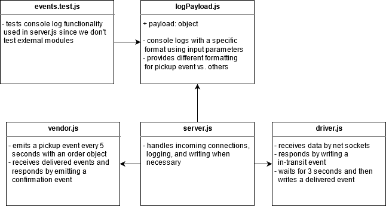

# Lab 17 — TCP Server

## Displaying Events by Console Logging Fake Deliveries!

Lab 16 and 17 for CF JS 401 Nights (n16)

### Author: Earl Jay Caoile

### Links and Resources

#### Submission Reqs

- [submission PR](https://github.com/earljay-caoile-401-advanced-javascript/caps-system/pull/2)
- [GitHub Actions](https://github.com/earljay-caoile-401-advanced-javascript/caps-system/actions)

#### Resources and Documentation

- [Code Fellows Supergoose](https://www.npmjs.com/package/@code-fellows/supergoose)
- [Events GitHub Repo](https://github.com/Gozala/events#readme)
- [Faker GitHub Repo](https://github.com/Marak/Faker.js#readme)

### Setup

- from the root directory, type `npm i` to install node packages
- type `npm start` and joyfully watch the app console log
- press `ctrl + c` to stop

### Example Output

```bash
EVENT pickup
- time: Thu May 07 2020 11:26:17 GMT-0700 (Pacific Daylight Time)
- store: one-to-one supply-chains
- orderID: 88360
- customer: Timmothy Orn
- address: 78728 Beier Forge, East Charlie, CA

DRIVER picked up order 88360

EVENT in-transit order 88360

DRIVER delivered 88360

VENDOR says: "Thank you for delivering order 88360"

EVENT delivered order 88360
```

### Tests

- Testing command: `npm test` from root directory

### UML


