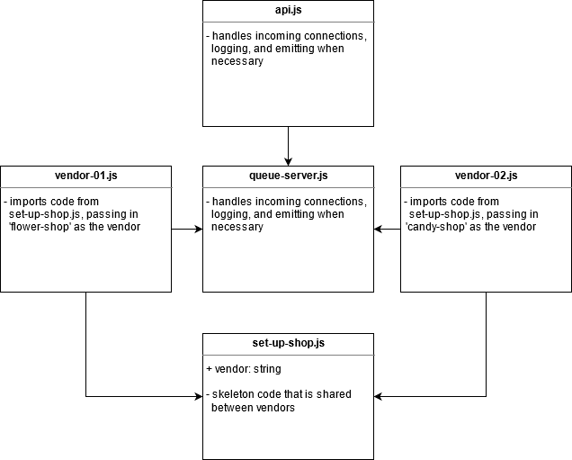

# Lab 19 — Message Queues

## Taking a break from passing in full orders to figure out message queues

Lab 16, 17, 18, and 19 for CF JS 401 Nights (n16)

### Author: Earl Jay Caoile

### Links and Resources

#### Submission Reqs

- [submission PR](https://github.com/earljay-caoile-401-advanced-javascript/caps-system/pull/4)
- [GitHub Actions](https://github.com/earljay-caoile-401-advanced-javascript/caps-system/actions)

#### Resources and Documentation

- [Faker GitHub Repo](https://github.com/Marak/Faker.js#readme)
- [Socket.io Tutorial](https://www.tutorialspoint.com/socket.io/)
- [Socket.io Emit Cheatsheet](https://socket.io/docs/emit-cheatsheet/)

### Setup

#### Main Lab Requirements

- from the root directory, type `npm i` to install node packages
- open 4 terminal windows
- start the 4 apps in the following order by typing each of the following in a terminal:
  - `npm run start-queue` (starts queue-server.js)
  - `npm run start-api` (starts api.js)
  - `npm run start-vendor-01` (starts vendor-01.js)
  - `npm run start-vendor-02` (starts vendor-02.js) 

### UML

