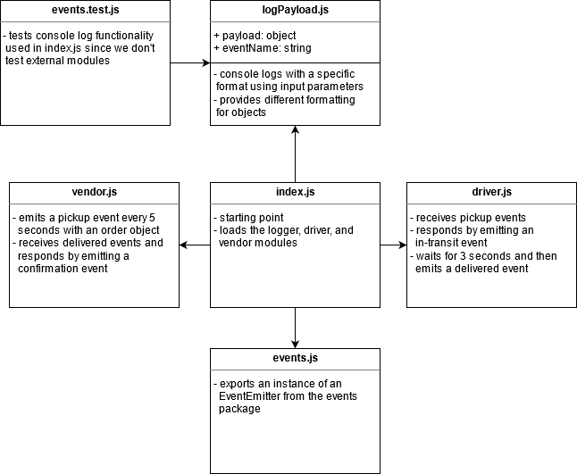

# Lab 16 — Event Driven Applications

## Displaying Events by Console Logging Fake Deliveries!

Lab 16 for CF JS 401 Nights (n16)

### Author: Earl Jay Caoile

### Links and Resources

#### Submission Reqs

- [submission PR](https://github.com/earljay-caoile-401-advanced-javascript/caps-system/pull/1)
- [GitHub Actions](https://github.com/earljay-caoile-401-advanced-javascript/auth-server/actions)

#### Resources and Documentation

- [Code Fellows Supergoose](https://www.npmjs.com/package/@code-fellows/supergoose)
- [Events GitHub Repo](https://github.com/Gozala/events#readme)
- [Faker GitHub Repo](https://github.com/Marak/Faker.js#readme)

### Setup
- from the root directory, type `npm i` to install node packages
- type `npm start` and joyfully watch the app console log
- press `ctrl + c` to stop

#### Tests

- Testing command: `npm test` from root directory

### UML

